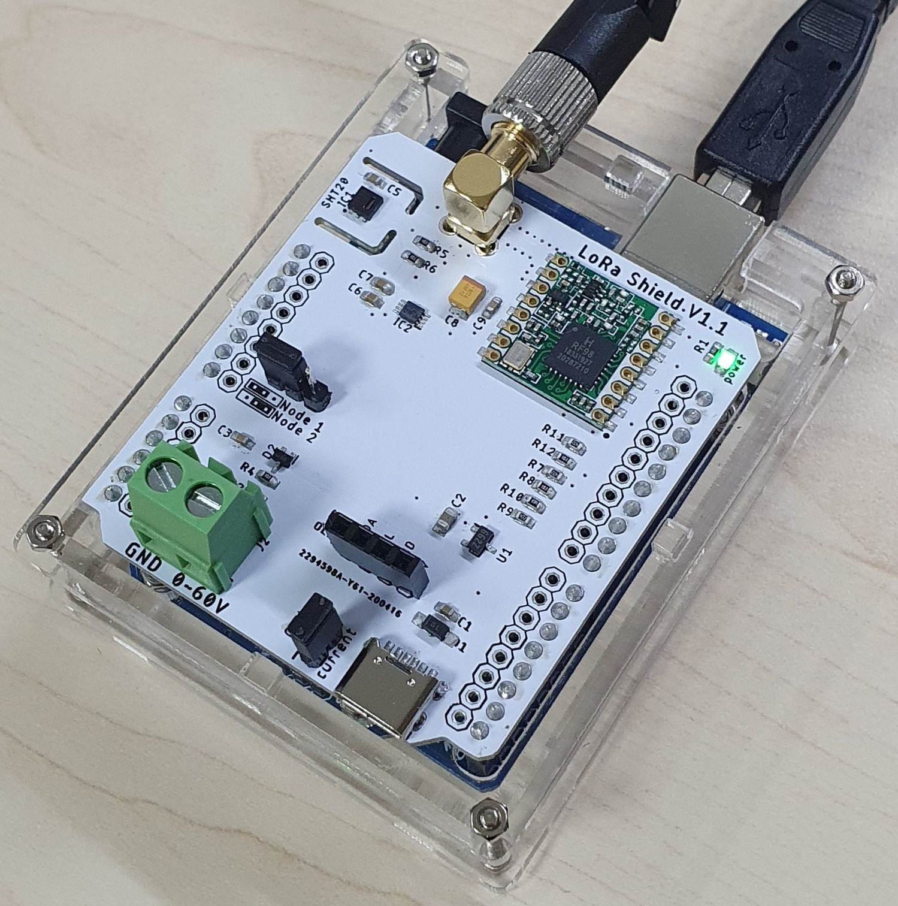

# RFM98W LoRa Shield
RFM98W based arduino LoRa shield with SHT20 sensor for temperature/humidity monitoring, 0~60V analog voltage input terminal, connectors for 0.96" OLED display, Type-C port for power input

## to-do
* LMIC library for LoRaWAN implementation
* HopeRF vs Murata LoRa module comparison
